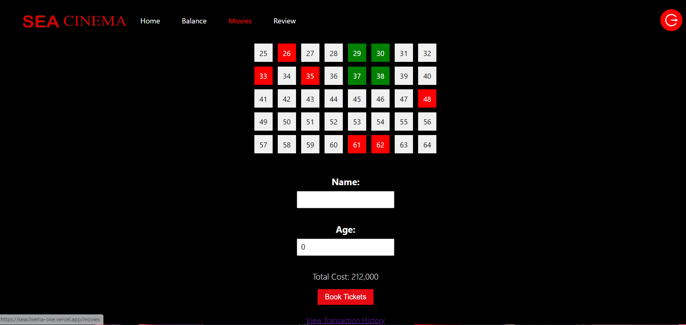
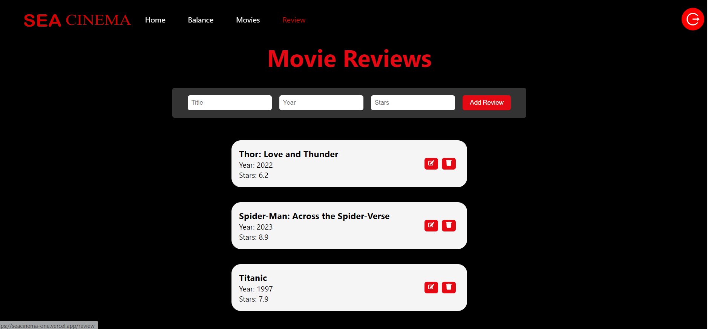

# SEA CINEMA Movie Ticket Booking Web
> *Source Code* ini dibuat oleh saya untuk memenuhi Seleksi Software Engineering Academy COMPFEST 15
> Telah dilakukan *deployment* pada aplikasi web yang dibangun pada tautan [berikut](https://seacinema-one.vercel.app/)

## Daftar Isi
- [Author](#author)
- [Deskripsi Singkat](#deskripsi-singkat)
- [Sistematika File](#sistematika-file)
- [Requirements](#requirements)
- [Cara Mengkompilasi dan Menjalankan Program](#cara-mengkompilasi-dan-menjalankan-program)
- [Cara Mengoperasikan Program](#cara-mengoperasikan-program)
- [Features](#features)
- [Screenshots](#screenshots)

## Author
| Universitas      | Nama                       | Github Profile                               |
| -------- | ---------------------------|----------------------------------------------|
| ITB | Austin Gabriel Pardosi   | [AustinPardosi](https://github.com/AustinPardosi)    |

## Deskripsi Singkat
Dalam project ini, dibangun sebuah aplikasi movie ticket booking sederhana. Aplikasi ini dirancang untuk memberikan pengalaman memesan film yang lancar dengan memungkinkan pengguna untuk menelusuri film, memesan tiket, mengelola saldo, dan menikmati fitur personalisasi. Aplikasi ini juga menggunakan firebase sebagai database dan autentifikasi.

## Sistematika File
```bash
.
├─── doc
├─── public
│   ├─── favicon.ico
│   ├─── index.html
│   ├─── logo192.png
│   ├─── logo512.png
│   ├─── manifest.json
│   ├─── robots.txt
├─── src
│   ├─── components
│   │   ├───BackgroundImage.js
│   │   ├───Card.js
│   │   ├───Header.js
│   │   ├───MovieSlider.js
│   │   ├───SliderContainer.js
│   │   ├───TopNav.js
│   ├─── pages
│   │   ├───HistoryPage.js
│   │   ├───LoginPage.js
│   │   ├───MoviePage.js
│   │   ├───MyListPage.js
│   │   ├───Netflix.js
│   │   ├───Player.js
│   │   ├───ReviewPage.js
│   │   ├───SignUpPage.js
│   │   ├───TheBalancePage.js
│   ├─── store
│   │   ├───index.js
│   ├─── utils
│   │   ├───constants.js
│   │   ├───firebase-config.js
│   ├─── App.css
│   ├─── App.js
│   ├─── index.css
│   ├─── index.js
├─── .gitignore
└─── package-lock.json
└─── package.json
└─── README.md
```

## Requirements
- React.js (versi 18.2.0)

## Cara Mengkompilasi dan Menjalankan Program
1. Lakukan *clone repository* melalui terminal dengan *command* berikut
    ``` bash
    $ git clone https://github.com/AustinPardosi/SEA_Cinema.git
    ```

2. Lakukan kompilasi dan unduh beberapa modul yang diperlukan dengan menjalankan *command* berikut
   ``` bash
    $ npm install
    $ npm start
   ```


## Cara Mengoperasikan Program
1. *Login* atau *Sign In* ke *website* dengan akun dibawah. Jika proses *login* berhasil, maka pengguna akan dihadapkan pada layar utama program.
   ``` bash
    Akun Dummy
    Email = abcdefgh@gmail.com
    Password = abcdefgh
   ```
2. Pilih film yang diinginkan pada bagian *Home* aplikasi.
3. Hover ke salah satu film dan tekan ```More Info``` untuk menampilkan detail film.
3. Tekan *Balance* pada TopNav untuk top up dan withdraw.
4. Tekan *Movies* pada TopNav untuk memesan dan membayar film.
5. Untuk menghapus histori transaksi, tekan link ```view transaction history``` pada page *Movies* untuk mengcancel transaksi.
6. Tekan *Review* pada TopNav untuk memberi review pada film.

## Features
*Mandatory Phase*
| No. | Nama Fitur | Status |
|-----|------------|:------:|
|1 |Everyone can see all movies. Everyone can see the details of a specific movie, including the title, description, age rating, poster, and ticket price.|:heavy_check_mark:|
|2 |Everyone can top up the balance (in Rupiah). The maximum amount is unlimited. Everyone can withdraw the balance (in Rupiah). The maximum amount that can be withdrawn is Min(current balance, 500.000) for each withdrawal.|:heavy_check_mark:|
|3 |Everyone can book movie tickets. Everyone can see the history of all successful transactions. Everyone can cancel a movie ticket transaction and the money will be refunded to the balance. The canceled ticket seats can be booked again. Each movie ticket transaction should include the identity of the booker, movie title, seat numbers, and total cost.|:heavy_check_mark:|

*Challenge Phase*
| No. | Nama Fitur | Status |
|-----|------------|:------:|
|1 |On the registration section, users must input their username, password, name, and age. Ensure that the username is not registered yet in the system|:heavy_check_mark:|
|2 |Users only need to enter their username and password. Only registered accounts can login.|:heavy_check_mark:|
|3 |Everyone can see all currently playing movies and the movie details.|:heavy_check_mark:|
|4 |Only logged in users can top up and withdraw their balance. Each registered user has its own balance.|:heavy_check_mark:|
|5 |Only logged in users can book tickets, view ticket transactions history, and cancel the ticket transactions. If the user's age is below the movie’s age rating, they cannot continue the transaction.|:heavy_check_mark:|


## Screenshots




